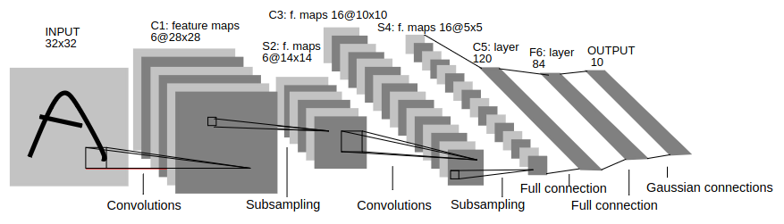
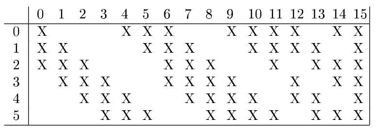
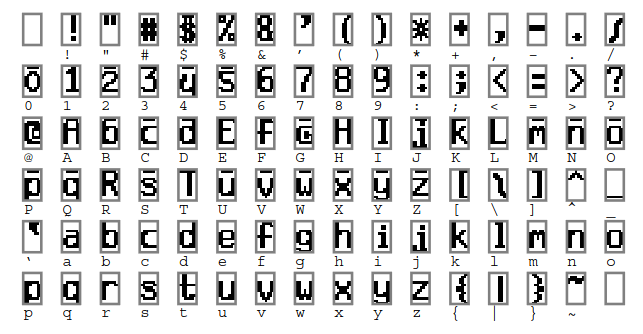
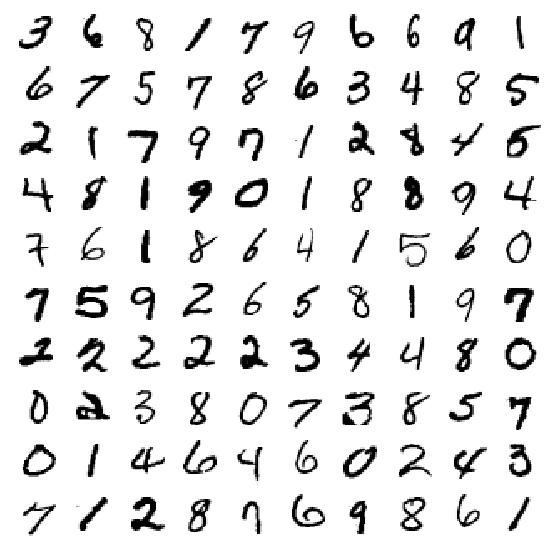
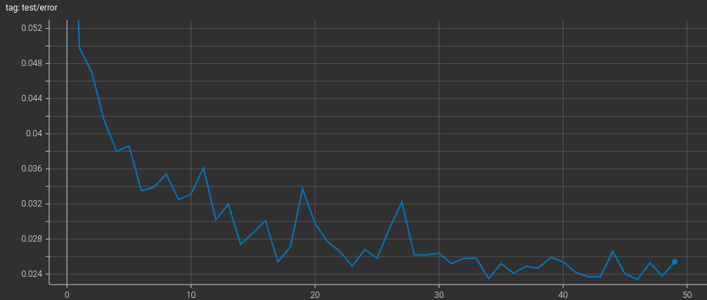

LeNet-5 CNN
============

LeNet-5 is a convolutional neural network (CNN) architecture proposed by Yann 
LeCun in 1998 for optical character recognition (handwritten digits). It is one 
of the first CNNs to be successfully applied. It can be found in section 2 of 
the paper :ref:`LeCun1998 <lecun1998gradient>`.
You can find my annotated copy of the paper `here <https://www.dropbox.com/scl/fi/rjwcnxxre3bjfk221gjm2/Y-LeCun-1998-Gradient-based-learning-applied-to-document-recognition.pdf?rlkey=v75dsceuwhl38elpqwoem5758&dl=0>`__. 
Refer to only section 2 for the LeNet-5 model, as the paper proposes many more 
things.

The model implemented here consists of the following (just like many AI models):

- **Model**: Original LeNet-5 architecture proposed in the paper
- **Data**: The MNIST dataset from `Yann LeCun's Blog <http://yann.lecun.com/exdb/mnist/>`__ containing annotated/labelled digits for training and testing
- **Optimizer**: The paper proposes an LM optimizer. The `Stochastic Gradient Descent optimizer <https://pytorch.org/docs/stable/generated/torch.optim.SGD.html>`__ is used here (since it comes with PyTorch).
- **Loss**: The same RBF (`Radial Basis Function <https://en.wikipedia.org/wiki/Radial_basis_function>`__) output loss with MAP (maximum a posteriori) penalty term.

.. contents:: Table of contents

These are further described below. See the paper for more details. The API code
documentation can be found at :py:mod:`mlhub.lenet`.

Model
------

The architecture for LeNet-5 is shown below

    
    The architecture from Figure 2 of the :ref:`LeCun1998 <lecun1998gradient>`
    paper.

The layers are defined below

- *Input* layer: The input is a ``(32, 32)`` grayscale image that is mean 
  normalized (the mean is 0 and standard deviation is 1 approximately).
- **C1** convolution layer is a simple `2D Convolution layer <https://pytorch.org/docs/stable/generated/torch.nn.Conv2d.html>`__ with 1 input channel (from
  the input layer), 6 output channels, and a ``(5, 5)`` kernel size (with 
  stride 1). The output of this layer is of shape ``(6, 28, 28)``.
- **S2** sub-sampling layer: Average the numbers, multiply with a trainable
  weight, and add a bias for each channel (of input). This is like average 
  pooling but there is a weight multiplication and a bias offset (the weight 
  and the bias are learnable parameters). This is implemented as standard 
  convolution with weights as ones and stride as the kernel size. The result is 
  multiplied with a trainable parameter, added with another. The sub-sampling
  is implemented as the :py:class:`SubSamplingLayer <mlhub.lenet.models.SubSamplingLayer>` class.
  The input and output of this layer are of shape ``(6, 14, 14)``.
- **C3** custom convolution layer: This is like the same convolution layer (like
  *C1*), but the weights of some input channels are masked off (set zero) so 
  that not every input channel is connected to every output channel (the kernel
  has a specific connectivity map). The output of this layer is of shape 
  ``(16, 10, 10)``.
- **S4** is another sub-sampling layer like *S1*. The output of this layer is of
  shape ``(16, 5, 5)``.
- **C5** is a convolution layer like *C1*. The output of this layer is of shape
  ``(120, 1, 1)``, which is flattened to ``120`` dimension vector.
- **F6** is a linear layer with ``84`` output units (dimension).
- *Output* layer is a radial basis function layer that outputs a ``10`` 
  dimensional vector (each element is for a digit - 0 through 9). The RBF is
  described in more detail below.

A sigmoid-like activation function is used in between the layers. It's 
formulated as

.. math:: 
  
  f(x; A, S) = A \; \mathrm{tanh}(S\,x)

This activation function is implemented as :py:class:`SigmoidSquashingActivation <mlhub.lenet.models.SigmoidSquashingActivation>`.
The entire network is implemented in the :py:class:`LeNet5 <mlhub.lenet.models.LeNet5>` class.

Custom Convolution Layer
^^^^^^^^^^^^^^^^^^^^^^^^^

    
    The connectivity map for layer **C3**, in Table 1 of the :ref:`LeCun1998 <lecun1998gradient>` paper.

The 6 rows in the above figure are for the 6 input channels and the 16 columns 
are for the 16 output channels. For example, the third output channel (column
heading 2 in the figure) is connected with 3rd through 5th input channels only.
The weights for other channels is set to zero (so they're not connected). 

The first six output channels are connected to sets of three consecutive input
channels, next six outputs are with sets of four consecutive input channels,
next three output channels are with sets of four disjoint input channels, and 
the last one is connected to all input channels (like in a normal convolution).

The reason for choosing this pattern, according to the paper, is to provide a 
split and to prevent the network from learning symmetric (same) weights. This 
is implemented as the :py:class:`CustomConvLayer <mlhub.lenet.models.CustomConvLayer>` class.

Radial Basis Function
^^^^^^^^^^^^^^^^^^^^^^

A radial basis function is parameterized by weights :math:`w_{ij}` (:math:`i` 
being ``[0, 9]`` and :math:`j` being ``[0, 83]``). It gets inputs :math:`x_j`
and the output :math:`y_i` (for the :math:`i^{th}` output unit) is given by

.. math::
  
  y_i = \sum_{j} \left ( x_j - w_{ij} \right )^2

This is basically the squared Euclidean distance from the weights. The weights
are not trainable and are a template. The weight values are ``+1`` or ``-1``.
The weights are made by the corresponding character representation on a 
``(7, 12)`` grid (``+1`` for black foreground and ``-1`` for white background).
The weights are flattened to match the ``84`` dimensional input shape.

  
  The initial template parameters (weights) of the RBF. We're only interested in
  digit characters 0 through 9. We can slide a ``(12, 7)`` grid and fill in the 
  template/weight values. From Figure 3 of the 
  :ref:`LeCun1998 <lecun1998gradient>` paper.

The output :math:`y_i` with the least value is the predicted digit. This is 
implemented as the :py:class:`RBFUnits <mlhub.lenet.models.RBFUnits>` class.

Data
-----

We use the digits MNIST dataset that contains size normalized handwritten
characters. There are ``60,000`` digits for training and ``10,000`` digits for
testing. Since there's isn't a separate validation set, we'll use the test set
as the validation set (this is unconventional). We do not use any distortions
for data augmentation when training. The entire dataset can be found on this
website: `<http://yann.lecun.com/exdb/mnist/>`_.

  
  Some handwritten examples from the MNIST dataset.

The dataset for this is implemented in the :py:class:`MNISTDataset <mlhub.lenet5.MNISTDataset>` class.

Loss
-----

The training loss for this method is the MAP (maximum a posteriori) criterion.
This means that in addition to pushing down the penalty of correct class (like 
the MSE criterion - the output of the RBF), this also pulls up the penalties of 
incorrect classes. The loss is formulated as follows

.. math::
  
  E(W) = \frac{1}{P} \sum_{p=1}^{P} \left ( y_{D^p} \left ( Z^p, W \right ) + log \left ( e^{-j} + \sum_{i} e^{-y_i (Z^p, W)} \right ) \right )

The above is Equation 9 of the :ref:`LeCun1998 <lecun1998gradient>` paper. Where
:math:`W` are the trainable parameters (weights) of the network, :math:`P` is 
the training batch size, :math:`Z^p` is an input sample from the batch,
:math:`D^p` is the label of the input sample, and :math:`j` is a small positive
number.

The first term :math:`y_{D^p} \left ( Z^p, W \right )` is the RBF output of the 
unit :math:`D^p` (correct output sample). We ideally want this to be zero since
the output of the RBF unit is the Euclidean distance from template (when the 
input to RBF matches the template, it should output ``0``).

The second term (containing the :math:`log` function) is to make all RBF units
output some value (so that they do not collapse to the trivial solution of 
outputting all zeros). The higher the :math:`y_i` value, the lower is the 
:math:`e^{-y_i}` value (and the lower is the loss).

The two terms ensure that the correct label is pushed down (lower value output) 
and the incorrect label is pushed up (higher value output). This is implemented
in the :py:class:`TrainingLoss <mlhub.lenet.train.TrainingLoss>` class.

Training
---------

The model was trained for 50 epochs using the `SGD optimizer <https://pytorch.org/docs/stable/generated/torch.optim.SGD.html>`__ with learning rate ``0.01``
and the model checkpoint for the lowest test error was saved (``2.34 %`` error 
on MNIST test set).

  
  The training curve showing test error decreasing with each epoch. It becomes 
  nearly stagnant after a few epochs.

Ideally, there is a separate validation set for selecting the best model. We use
the test split here. 
See the :py:mod:`mlhub.lenet.train` module for more information on the API.

Results
--------

References
-----------

The following are great resources for learning about CNNs

- `What are CNNs - IBM Blog <https://www.ibm.com/topics/convolutional-neural-networks>`__
- Towards data science posts: `here <https://towardsdatascience.com/a-comprehensive-guide-to-convolutional-neural-networks-the-eli5-way-3bd2b1164a53>`__ and `here <https://towardsdatascience.com/convolutional-neural-networks-explained-9cc5188c4939>`__
